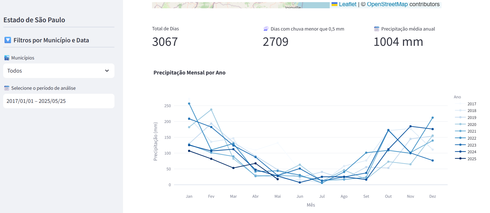

# 🌦️ Streamlit-Clima São Paulo

🗺️ **Análise Climática interativa para o estado de São Paulo**

Este projeto utiliza a biblioteca Streamlit no Python para criar uma aplicação interativa que permite explorar dados climáticos de **precipitação** e **temperatura** do [NASAPOWER](https://power.larc.nasa.gov/), com recorte espacial para **todos os municípios do estado de São Paulo**.

---

## 📈 Demostração:
🔗 Acesse o app online:
👉 [app-clima-sp.app](https://app-clima-sp-igzpcvbcsc4mvhkpcykhen.streamlit.app/)




---

## Aplicações:
- Filtros interativos por **Município** e **Data**
- Visualizações interativas com **Plotly** (gráficos por mês e por ano)
- Mapas com **Folium**, com zoom automático para municípios
- Métricas adicionais:
  - Dias com chuva menor que 0.5 mm
  - Dias com temperatura extrema (> 35°C ou < 5°C)
  - Total de dias do período  

---

## 🛠️ Tecnologias:
- `python`
- `streamlit`
- `pandas`
- `plotly`
- `numpy`
- `folium`
- `datetime`
- `json` , `os`

---

## 🌧️ Como executar esse projeto:

1. Clone este repositório:
```bash
git clone https://github.com/ThiagoWGdeOliveira/streamlit-clima-sp.git
cd streamlit-clima-sp
pip install -r requirements.txt
streamlit run app.py
```

# 📊 Dados:
Os dados utilizados foram obtidos automaticamente via API do [NASAPOWER](https://power.larc.nasa.gov/), com granularidade diária e cobertura municipal para o estado de São Paulo.
Todos os dados são públicos e livres de confidencialidade.


# 👨‍💻 Autor:
**Thiago Wendling Gonçalves de Oliveira**
[linkedln](https://www.linkedin.com/in/thiago-w-g-de-oliveira/) |
[🔗 Visualizar o App no Streamlit](https://app-clima-sp-igzpcvbcsc4mvhkpcykhen.streamlit.app/)
